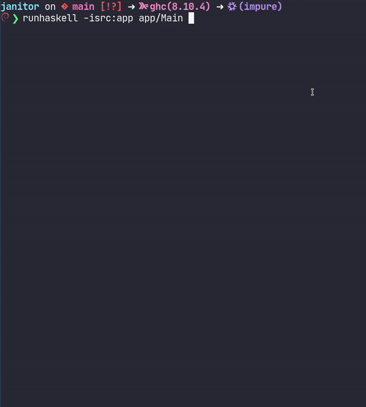

## Janitor

A command line interface made with haskell that uses the Twitter API v1.1
to read and delete tweets.

```
Usage: janitor COMMAND

  First, with a Twitter Dev account you need to export 4 tokens/keys

        export OAUTH_TOKEN=...
        export OAUTH_SECRET=...
        export CONSUMER_KEY=...
        export CONSUMER_SECRET=...

  Commands:

    verify         Verify your credentials
    read           Show some of yours Tweets
    deleteall      Delete all Tweets that are returned by the read command
    help           Show this help text


  Eg:

    janitor verify
```



## Static Binary

There is a fully static binary (for GNU/Linux) built with the GHC 9.0.1 (native bignum enabled) in the [releases page](https://github.com/jeovazero/janitor/releases).


#

> For fun by jeovazero
